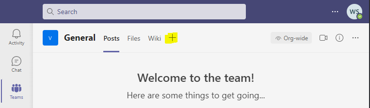

# Microsoft Teams

## How to embed into Microsoft Teams

1. Click the plus sign in a channel

  2. Click "Website"

  3. Insert into "Tab Name":`Vaxx.nz`and "Website": `https://widget.vaxx.nz` . Click "Save"

4. The widget will now be embedded within Microsoft Teams

## 

